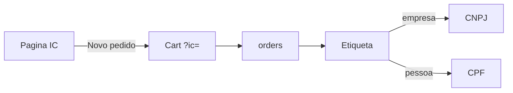

# Clientes institucionais — Fluxos

## Cadastro no painel

1. Menu **Clientes Institucionais** → Criar
2. Pergunta: **É uma empresa?**
 - Sim → razão social + CNPJ (+ contatos opcionais da empresa)
 - Não → só representante
3. Sempre: representante (nome, CPF, e-mail, celular) + endereço (rua, CEP, …)
4. Modal de detalhe: editar dados/endereço, anotações, histórico, **Novo pedido**

Deep link: `/app/acolhimento/clientesinstitucionais?ic={client_code}`

## Novo pedido

1. Da página do cliente → **Novo pedido** → `/app/loja/novo-pedido?ic={client_code}`
2. Carrinho carrega o cliente institucional (sem exigir `?u=`)
3. Submit grava pedido com vínculo institucional; etiqueta usa CNPJ ou CPF conforme `is_company`
4. Em Pedidos, reabrir carrinho usa `?ic=` se o pedido for institucional

