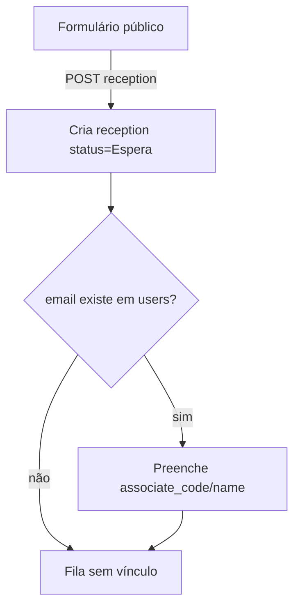
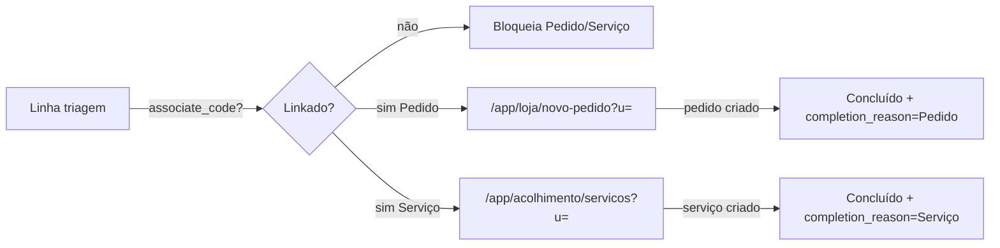

# Triagem — Fluxos

## 1. Entrada na fila (formulário externo)

1. Associado/lead abre o **formulário público de triagem** (URL pública configurável; campos definidos no admin).
2. Preenche os campos visíveis (padrão + personalizados).
3. Submit → `POST` cria registro em `reception`:
   - `status` = valor do status **Espera** (chave estável `waiting`; label editável no admin)
   - `code` = UUID gerado
   - `date_created` = now
   - Campos padrão mapeados para colunas de `reception`
   - Campos personalizados gravados em `tags` (JSONB) sob chave `custom_fields` (ver [fields.md](./fields.md))
4. **Vínculo por e-mail** (obrigatório neste passo):
   - Se `email` informado → buscar associado em `users` com o mesmo e-mail (normalizado, case-insensitive)
   - Se existir → preencher `associate_code`, `associate_name`, `is_associate` adequado, e opcionalmente `avatar_url` / `patient_name` se disponíveis
   - Se não existir → permanece sem vínculo (`associate_code` null); entra na fila normalmente

## 2. Operação na página de triagem (`apps/kunk`)

1. Operador abre `/app/acolhimento/triagem`.
2. Carrega `reception` (lista + filtros).
3. **Sidebar lateral de status** (configurados no admin):
   - Cada status mostra **contagem** dos registros com aquele status (como no legado).
   - Status padrão de entrada: **Espera**.
   - Status terminal padrão: **Concluído** (legado: `Finalizado` + `action` → schema alvo `completion_reason`).
4. Clique no **avatar** da linha → menu para selecionar outro status (lista = statuses cadastrados no admin, inclusive os custom).
5. Busca textual (nome, e-mail, telefone, código) e filtros auxiliares (ex.: atendente), sem Utalk/Beeviral.
6. Ações por linha (mínimo v1):
   - Editar telefone / tags (se mantidos)
   - **Linkar / deslinkar** associado manualmente
   - **Pedido** → só habilitado se `associate_code` preenchido
   - **Serviço** → só habilitado se `associate_code` preenchido
   - Abrir módulo de **documentos/dados** do associado — **somente se** o módulo estiver ativo no admin

## 3. Redirecionamento para pedidos / serviços

### Regras

| Condição | Comportamento |
|---|---|
| Sem `associate_code` | Botões Pedido/Serviço **desabilitados** + mensagem para linkar |
| Com `associate_code` | Navega para pedido/serviço com query `u={associate_code}` (padrão legado) |

### Contabilização (como no legado)

Ao **criar** o pedido ou o serviço (não necessariamente no clique do redirect):

1. Localizar `reception` aberta vinculada ao e-mail / associado (status ≠ Concluído).
2. Marcar como concluída:
   - `status` = status **Concluído** (config)
   - `completion_reason` = `Pedido` \| `Serviço` (legado: `action`)
3. A contagem da sidebar atualiza: sai de Espera (ou status intermediário) e entra em Concluído.

**Redirect para serviços com finalização imediata** (opcional, espelhando legado `appointmentRedirect`):

- Pode PATCH `completion_reason=Agendamento` (ou `Serviço`) + status Concluído **no momento do redirect**, se o produto mantiver esse comportamento. Registrar a escolha em [gaps.md](./gaps.md) na implementação.

## 4. Status customizados

- Admin cadastra statuses além de Espera e Concluído (ex.: “Aguardando Retorno”, “Aguardando Cadastro”).
- Valores persistidos em `system_configs` (`system=triage`).
- UI da sidebar e do menu do avatar leem a lista dinâmica.
- Contagens = `COUNT` por `reception.status` igual ao **value** do status (não o label).

## 5. Módulo documentos/dados (opcional)

- Feature flag em `system_configs`: `triage.module.associate_docs` (default `false`).
- Quando **desabilitado**: não renderizar entrada “Documentos/Dados” na linha; APIs do módulo podem existir mas a UI da triagem não expõe.
- Quando **habilitado**: abrir painel/modal do associado (dados + documentos), no espírito do `UserModal` legado, **sem** aba de histórico de doações.

## 6. O que não entra no fluxo

- Sync Utalk / transfer / chatId como eixo da fila
- Match Beeviral / `bvid`
- Modal “Histórico de doações”
- FAB de sync WhatsApp
